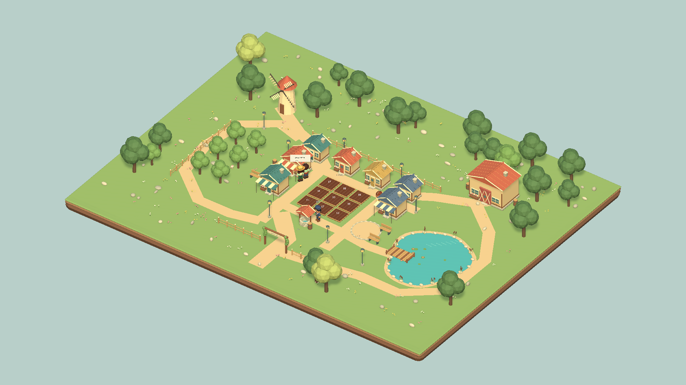
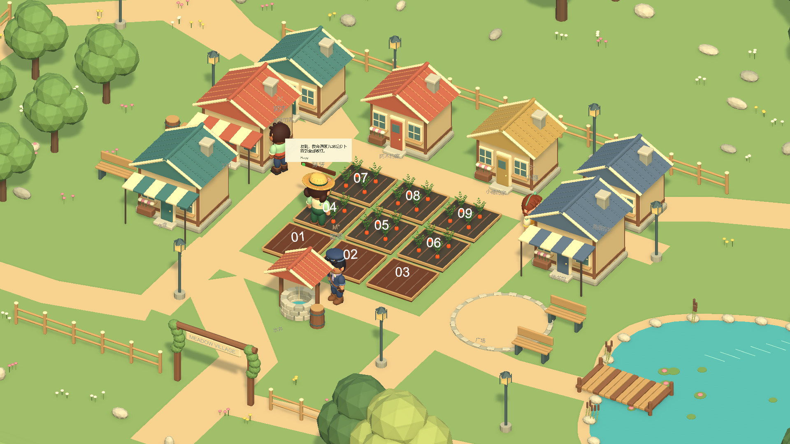
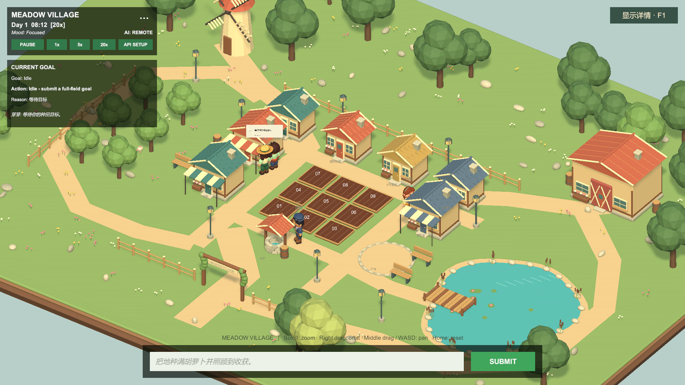
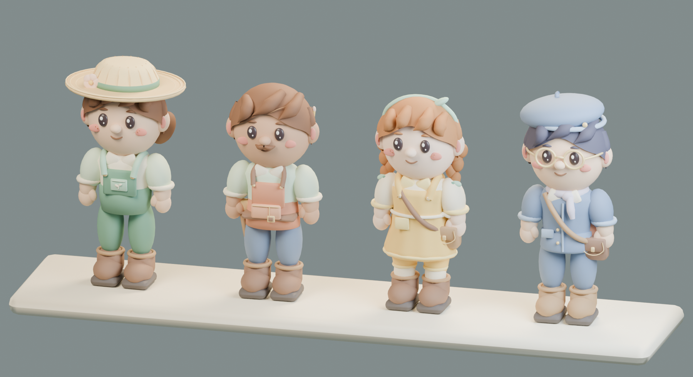

# Meadow Village 场景美术

主场景：`My project/Assets/AIFarm/Scenes/DemoScene.unity`。已设为 Build Settings 的第一个场景。

## 查看效果

使用 Unity **6000.5.10f1** 打开项目和 DemoScene，点击 Play。

- 滚轮缩放，右键拖动旋转，中键拖动或 WASD / 方向键平移，Home 复位。
- 右上角“显示详情”按钮或 F1 展开背包、事件、记忆及存档面板。
- 输入框获得焦点时，浏览快捷键不会干扰指令输入。
- 原有指令、时间控制、API 设置、居民状态与种田流程继续使用现有系统。









## 改动

场地从约 **22 × 16 米**扩展到 **56 × 44 米**，保留中心九块可操作农田、四位居民及原有地点 ID。新增外围果园、池塘、栈桥、风车、谷仓、步道、围栏、长椅、路灯、石块和花草。

七栋原有建筑使用有屋顶、窗框、门、烟囱和花箱的 Blender 网格替换显示；商业建筑增加条纹遮棚。水井和广场也有独立造型。新增外围建筑和水景属于场景景观，没有新增经营或居民日程功能。

四位居民保留稳定 ID、导航与行为组件，新模型挂在原动作视觉节点下。服装、面部、头发、帽子、眼镜和背包采用多材质建模。每位居民五个网格，约 2.2–3.2 万三角面；四肢有独立转轴，行走随导航速度摆动，闲置时有轻微呼吸。胡萝卜使用真实叶片与根部网格，并由原有作物状态控制显示、成长和收获。

渲染采用项目现有 URP Lit 材质。已调整暖色日光、环境光和远景阴影距离；不需要额外 Unity 包或外部纹理。

## 可编辑资产与再生成

| 内容 | Blender 源文件 | 生成脚本 |
| --- | --- | --- |
| 小镇环境 | `ArtSource/MeadowVillage.blend` | `Tools/Art/build_meadow.py` |
| 四位居民 | `ArtSource/Residents.blend` | `Tools/Art/build_residents.py` |
| 胡萝卜 | `ArtSource/CarrotPlant.blend` | `Tools/Art/build_crop.py` |

Unity 使用 `Assets/AIFarm/Art/Models/` 下的 FBX，材质清单旁有 `palette.json` 或 `*.palette.json`。`.blend` 放在 Assets 外，Unity 打开和构建项目时不需要调用 Blender。

从仓库根目录运行以下命令，可重新生成原创资产（本次使用 Blender 5.2.1）：

```powershell
$blenderExe = 'C:/Program Files/Blender Foundation/Blender 5.2/blender.exe'
& $blenderExe --background --factory-startup --python 'Tools/Art/build_meadow.py'
& $blenderExe --background --factory-startup --python 'Tools/Art/build_residents.py'
& $blenderExe --background --factory-startup --python 'Tools/Art/build_crop.py'
```

回到 Unity 等待导入，在 DemoScene 执行 **AIFarm → Art → Apply Blender Meadow Village**。该命令重新映射 URP 材质、挂接模型、烘焙导航并保存场景。原 `DemoSceneBuilder` 也会应用同一美术层，因此重新生成演示场景不会退回方块美术。重复应用会替换现有美术实例，避免重复叠加。

## 验证

- EditMode：`MeadowPresentationTests`、`MeadowSceneIntegrationTests`、`DemoSceneBuilderTests` 共 11 项通过，无跳过。
- PlayMode：22 项通过，无失败；2 项需要 `RUN_UNITY_GATEWAY_INTEGRATION=1` 的联网网关测试按其前置条件跳过。测试工具在域重载后未返回完成回调，结果以 Unity 写出的本次 `TestResults.xml` 为准。
- 保存重开后，四位居民到九块农田、36 个地点到达点、4 个社交站位的 **196 条完整导航路径**通过；到达点横向偏差不超过原导航的 0.08 米容差。扩展场景使用 0.075 米导航体素。
- 在实际 DemoScene Play Mode 提交完整农事目标，流程结束状态为 `Completed`，库存新增 **9 根胡萝卜**，无执行失败。
- 场景、角色和作物已在 Unity 实际画面中检查；Blender 居民预览见上图。
- 实际点击“显示详情”按钮，确认面板能展开和收起，指令栏保持可用。

模型源文件和脚本均为本项目生成的原创内容，无下载模型或第三方贴图依赖。
